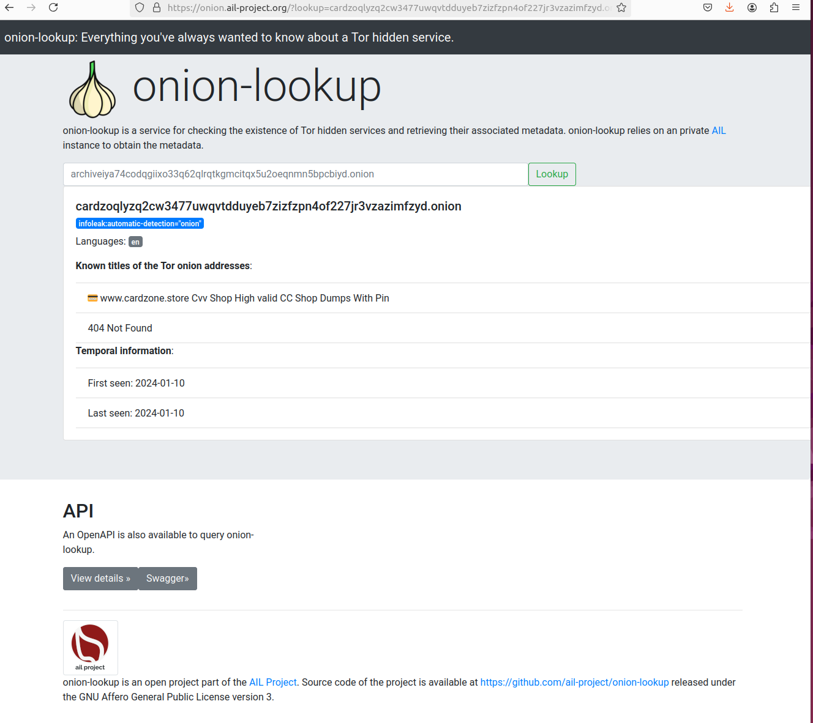

# onion-lookup

Software back-end and services for checking the existence of Tor hidden services and retrieving their associated metadata. onion-lookup relies on an AIL instance to obtain the metadata.

## Online version of onion-lookup

You can use Onion-Lookup online, including the API, without restrictions at the following location: [https://onion.ail-project.org/](https://onion.ail-project.org/).

# License

This software is licensed under GNU Affero General Public License version 3.

- Copyright (C) 2024 CIRCL - Computer Incident Response Center Luxembourg
- Copyright (C) 2024 Alexandre Dulaunoy
- Copyright (C) 2024 AIL Project
